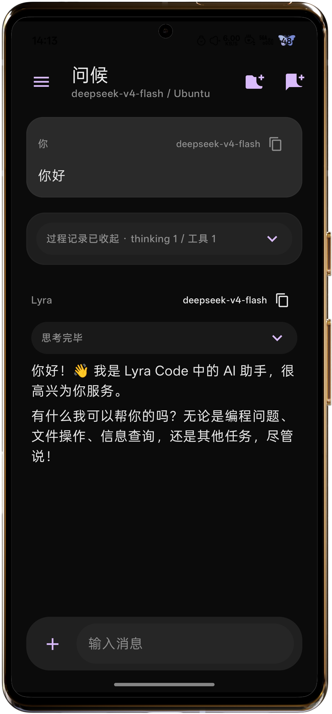
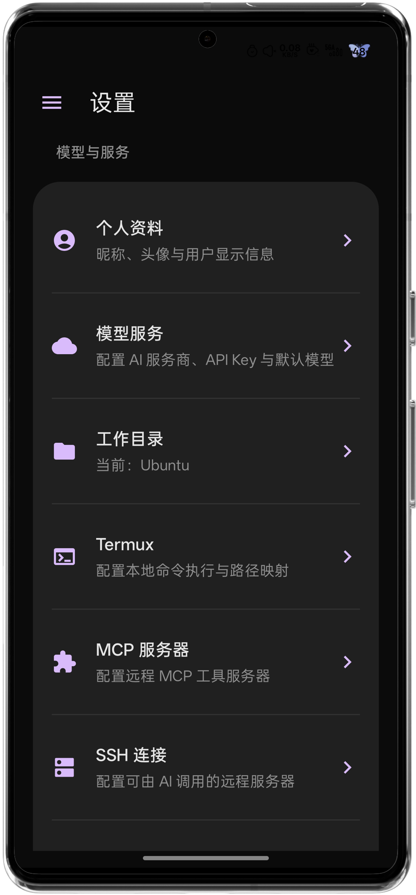
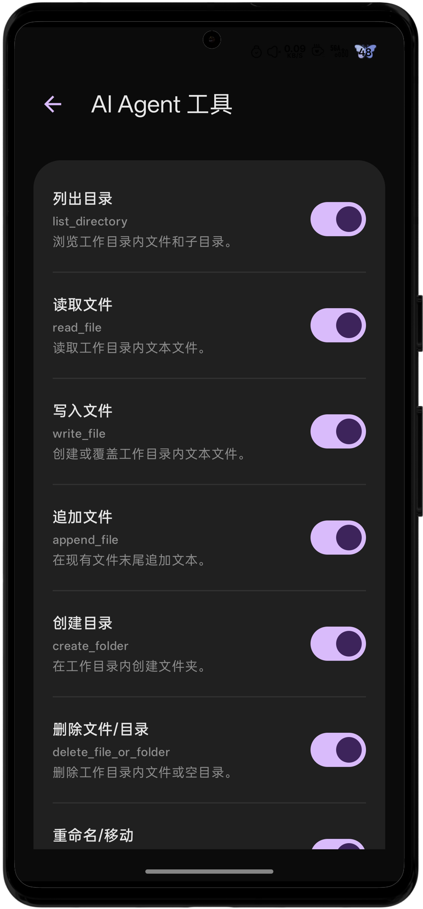

# Lyra Code

<p align="center">
  
</p>

<p align="center">
  <strong>面向 Android 的本地 AI Agent 应用</strong>
</p>

<p align="center">
  <a href="README.md">English</a> ·
  <a href="https://github.com/Soffd/Lyra-Code">GitHub</a> ·
  <a href="https://gitee.com/yukisoffd/lyra-code">Gitee</a>
</p>

<p align="center">
  
  
  
  
  
</p>

Lyra Code 是一个面向 Android 的本地 AI Agent 应用。它把大模型对话、文件工具、命令执行、联网搜索、MCP、SSH、WebDAV、数据备份和 Skills 能力包整合到移动端，让手机也能承担编程、写作、检索、远程维护和自动化任务。

## 界面预览

| AI 对话 | 设置 | Agent 工具 |
| --- | --- | --- |
|  |  |  |

## 核心能力

### 多模型与多接口

- 支持 OpenAI Chat Completions 兼容接口。
- 支持 Anthropic Messages API。
- 支持 Gemini GenerateContent API。
- 可保存多个模型服务商、API Key、基础 URL 和预设模型。
- 对话中可快速切换服务商、模型、系统提示词和推理深度。
- 支持 HTTP API URL，但会提示明文连接风险。

### Agent 工具

- 文件读取、写入、追加、重命名、移动、删除、目录创建和全局文件搜索。
- 命令执行与 Termux RunCommandService 集成，支持 stdout/stderr 回传。
- TODO 规划、过程记录、文件变更审查和差异可视化。
- 联网搜索、网页读取和来源标注。
- 时间感知、地理感知和配置管理。
- 多轮工具调用、用户审查确认、当前会话免确认。

### MCP / SSH / WebDAV

- MCP：支持 Streamable HTTP / SSE 远程 MCP Server。
- SSH：支持密码或密钥登录 Linux、Windows、Git 服务器，并执行经用户确认的命令。
- WebDAV：支持列出文件、PROPFIND、搜索、上传、下载和云备份。
- 支持通过自然语言管理 MCP、SSH、WebDAV、Skills 和 Agent 工具配置。

### Skills 能力包

- 支持从文件导入 zip 或单个 `SKILL.md`。
- 支持从 GitHub / Gitee / GitLab 仓库链接导入。
- 支持手动编辑 `SKILL.md` 创建 Skill。
- Agent 会先读取 `name` / `description` 判断是否相关，再按需读取 Skill 内部文件，避免上下文爆炸。

### 多模态与内容渲染

- 支持图片上传、拍照上传、裁剪、旋转、画笔和马赛克标注。
- 支持用户和 AI 发送图片/视频的缩略图、预览和保存。
- 支持 Markdown、表格、代码块、LaTeX 数学公式和媒体 Data URL 渲染。
- 支持 AI 生成或返回的 base64、URL、本地媒体文件预览与另存。

### 数据与备份

- 支持导出/导入个人资料、对话历史、模型配置、MCP、SSH、WebDAV、系统提示词、Skills、沉浸扮演设定等。
- 支持本地 zip 备份和 WebDAV 云备份。
- 支持补充模式导入并尽量去重，降低已有配置和密钥被覆盖的风险。
- 支持不包含 API Key 的安全导出，也支持包含密钥的完整迁移备份。

### 沉浸扮演模式

- 可导入角色设定包，配置 AI 昵称、头像、聊天背景和表情包短代码。
- 普通对话和沉浸扮演对话历史相互隔离。
- 支持好感度状态、表情包替换和角色记忆。
- 沉浸扮演模式下使用更接近聊天软件的气泡界面。

## 项目结构

```text
app/                         Android 应用模块
app/src/main/java/...        Kotlin / Jetpack Compose 源码
third_party/jlatexmath/      JLaTeXMath Android fork，用于 LaTeX 公式渲染
example-img/                 README 示例截图
gradle/                      Gradle Wrapper 配置
```

## 构建要求

- Android Studio 或命令行 Android SDK
- JDK 11+
- Android SDK 36
- Gradle Wrapper

构建 Debug 包：

```powershell
.\gradlew.bat assembleDebug
```

生成文件通常位于：

```text
app/build/outputs/apk/debug/
```

Release 包建议在 Android Studio 中手动配置签名后构建。请勿提交签名密钥、keystore、API Key、`.env`、`local.properties` 或任何本地隐私文件。

## Termux 配置

使用 `run_command` 前，需要在 Termux 中允许外部应用调用：

```bash
mkdir -p ~/.termux && (grep -qxF 'allow-external-apps=true' ~/.termux/termux.properties || echo 'allow-external-apps=true' >> ~/.termux/termux.properties) && termux-reload-settings
```

然后在 Lyra Code 的设置页面中授予 Termux 通信权限。未授权时，`run_command` 会自动禁用。

## 安全说明

Lyra Code 会处理 API Key、SSH 密码/私钥、MCP Token、WebDAV 密码、对话内容、本地文件和远程服务器输出。请注意：

- 使用 HTTP 明文 API、MCP 或 WebDAV 服务时，数据可能被中间人读取。
- 让 AI 执行命令、修改文件、上传/下载文件或操作远程服务器前，应审查工具调用内容。
- 包含密钥的备份文件应妥善保存，不要公开分享。
- 本项目不会替你判断远程脚本、MCP Server、Skills 仓库或 SSH 命令是否可信。

## PR 说明

本项目不接受外部 PR。若你有反馈或建议，请提交 Issue。若需要长期修改，请 Fork 本仓库自行维护，或联系仓库持有人。

## 许可证

本项目采用双重许可：Lyra Code 原创源代码可在 AGPLv3-or-later 下使用；如果需要闭源分发、私有修改、商业例外或不希望遵守 AGPL copyleft 义务，需要获取商业许可证。第三方组件仍以其各自许可证为准。

详见 [LICENSE](LICENSE) 和 [THIRD_PARTY_NOTICES.md](THIRD_PARTY_NOTICES.md)。
